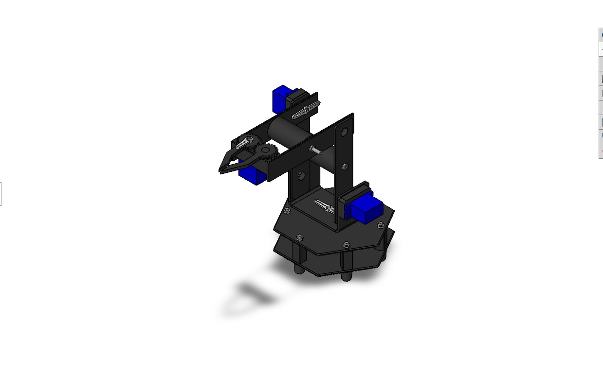
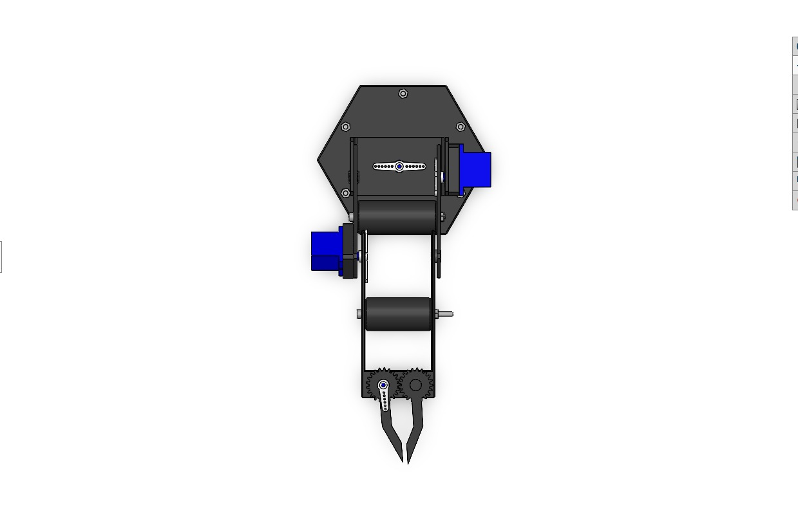
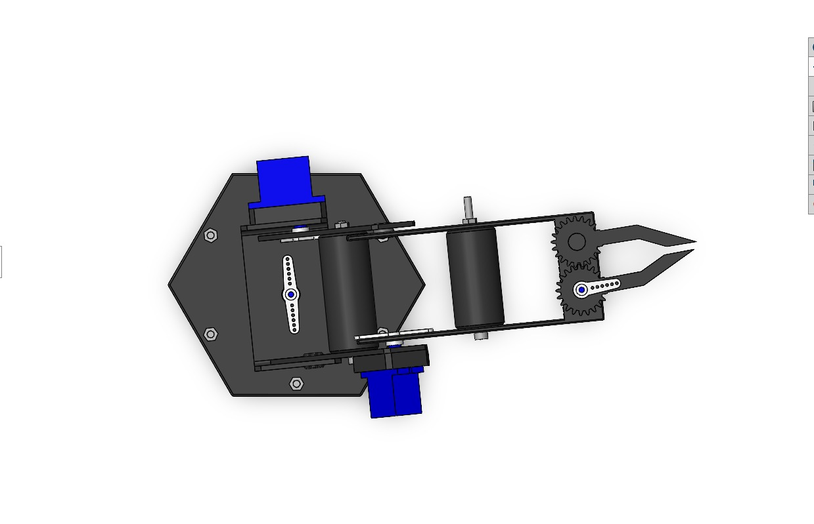
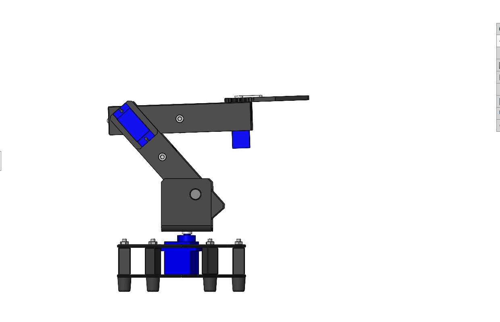
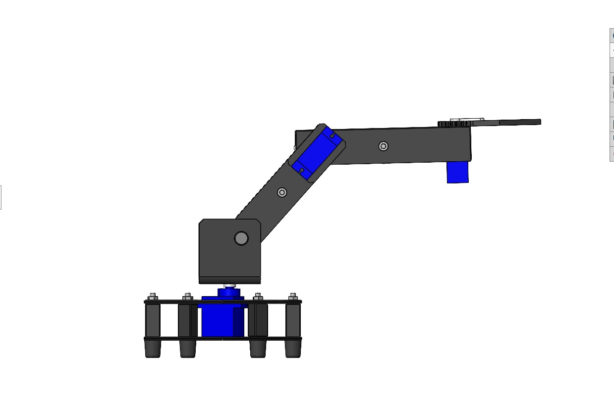
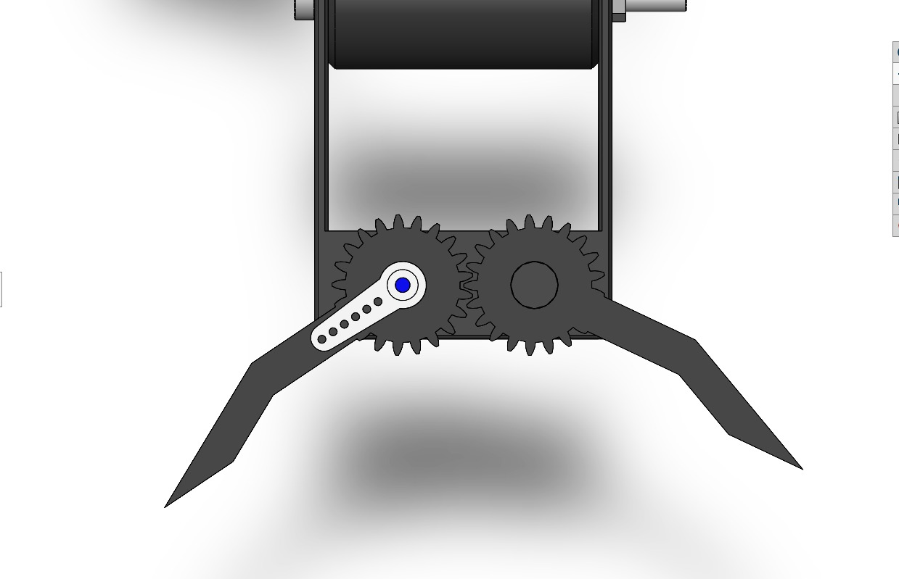
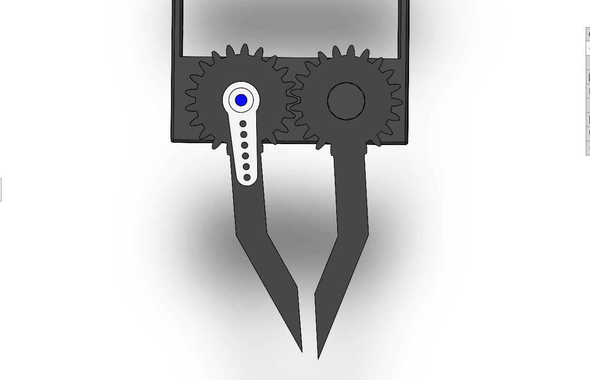

# 4-DOF Robotic Arm Simulation

## Overview
This project is a 4-degree-of-freedom robotic arm designed and simulated in SolidWorks.
It demonstrates basic robotic arm structure, joint constraints, and end-effector actuation.

## Degrees of Freedom
The robotic arm has four degrees of freedom, all implemented using revolute joints:
1. Base rotation
2. Base forward and backward motion achieved through rotation
3. Shoulder forward and backward motion
4. Gripper (claw) opening and closing motion

All joints in the system are modeled as revolute joints, and all links are treated as rigid bodies.
The arm does not include wrist rotation but includes an actuated end-effector.

## Model Overview

## Motion Demonstration

### Base Rotation

### Arm Forward and Backward Motion

### Gripper Actuation

## Tools Used
- SolidWorks

## Limitations
- No wrist rotation
- No sensors, actuators, or control system modeled
- No force, torque, or stress analysis included

## Status
Completed
